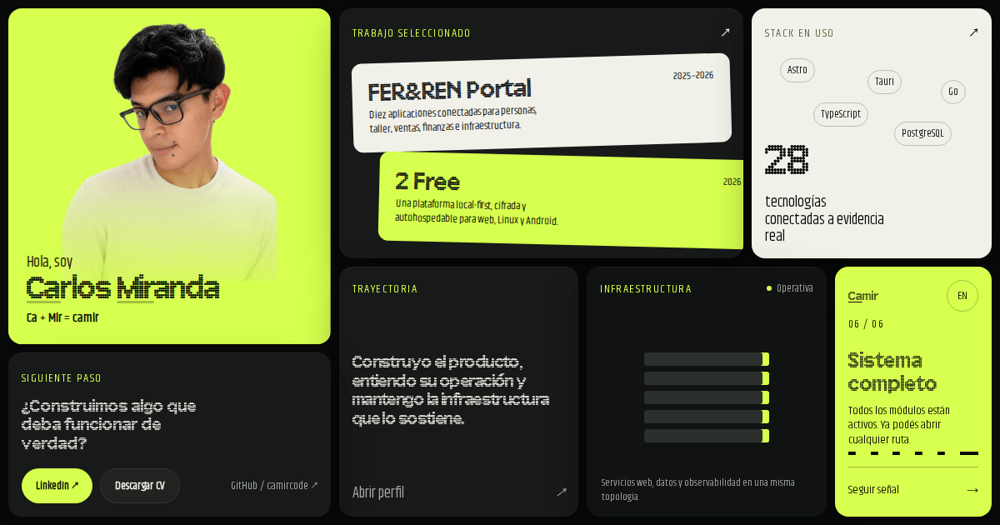

# camir.tech

[](https://github.com/camircode/portfolio/actions/workflows/quality.yml)

A bilingual systems portfolio for **Carlos Miranda**, built as an interactive operations rack rather than a conventional project gallery.

[GitHub profile](https://github.com/camircode) · [2 Free](https://github.com/camircode/2free)



## What It Demonstrates

- An immersive, guided home experience with real, indexable routes behind every module.
- Spanish-first content with equivalent English routes under `/en/`.
- Detailed system maps for FER&REN Portal and the open-source [2 Free](https://github.com/camircode/2free) platform.
- Dedicated articles for every project area and technology instead of a client-side-only gallery.
- Static-first Astro pages enhanced with GSAP, Three.js, Remotion media, and Astro View Transitions.
- Progressive enhancement, reduced-motion support, keyboard access, structured data, and sitemap generation.

## Architecture

| Layer | Responsibility |
| --- | --- |
| `src/data/` | Shared typed content for both languages, projects, modules, technologies, and case-study narratives. |
| `src/pages/` | Spanish canonical routes and their English equivalents. |
| `src/components/` | The immersive rack, project maps, article surfaces, navigation rails, and media evidence. |
| `src/scripts/` | Progressive Three.js module artifacts. |
| `video/` | Remotion compositions for sanitized Portal workflow demonstrations. |
| `public/assets/` | Production fonts, logos, screenshots, posters, and generated demo videos. |
| `scripts/` | Site auditing, resume generation, and Portal demo rendering. |

The site ships usable HTML first. JavaScript adds guided activation, spatial transitions, motion, and bounded 3D scenes without becoming a requirement for accessing the content.

## Local Development

### Requirements

- Node.js 22.12 or newer
- pnpm 11
- Chromium, installed through Playwright when running the browser audit

### Setup

```bash
pnpm install
cp .env.example .env
pnpm astro dev --background
```

The development server is available at `http://localhost:4321`.

```bash
pnpm astro dev status
pnpm astro dev logs
pnpm astro dev stop
```

### Environment

| Variable | Purpose |
| --- | --- |
| `PUBLIC_2FREE_URL` | Optional public URL for the future 2 Free landing page. The live-site action remains hidden when this value is empty. |

No credentials or private infrastructure values are required to build the portfolio.

## Commands

| Command | Purpose |
| --- | --- |
| `pnpm astro check` | Validate Astro and TypeScript. |
| `pnpm build` | Generate the production site in `dist/`. |
| `pnpm audit:site` | Audit responsive routes, interactions, media behavior, motion preferences, and internal links in Chromium. |
| `pnpm generate:demos` | Render the sanitized Portal videos and posters with Remotion. |
| `pnpm generate:cv` | Regenerate the public English resume files. |

Run the full production verification with:

```bash
pnpm astro check
pnpm build
pnpm astro dev --background
pnpm audit:site
pnpm astro dev stop
```

## Content Model

Projects, project modules, and technologies live in `src/data/content.ts`. Their longer implementation narratives live in `src/data/stories.ts`. Both language versions consume the same typed records so route order, relationships, and technical claims stay aligned.

When adding an item, preserve a real route in both languages and update the shared data rather than duplicating content inside page templates.

## Privacy Boundary

FER&REN Portal is a private production system. This repository does **not** contain its source code, credentials, internal URLs, customer records, employee records, financial information, or production infrastructure configuration.

Portal media is recreated with Remotion from verified workflows, using fictional records and no production connection. Public screenshots are limited to unauthenticated screens or sanitized demonstrations. The generated media explains the workflow but does not reproduce the complete production interface or user experience.

## Deployment

`astro build` produces a static site suitable for any static host. The reserved production origin is configured as `https://camir.tech` in `astro.config.mjs`; update it before deploying a fork under another domain.

## Rights

Copyright © 2026 Carlos Miranda. All rights reserved.

This repository is source-available for review. No open-source license is granted. Personal content, branding, resumes, certificates, project media, and third-party marks may not be reused without the relevant owner's permission.
